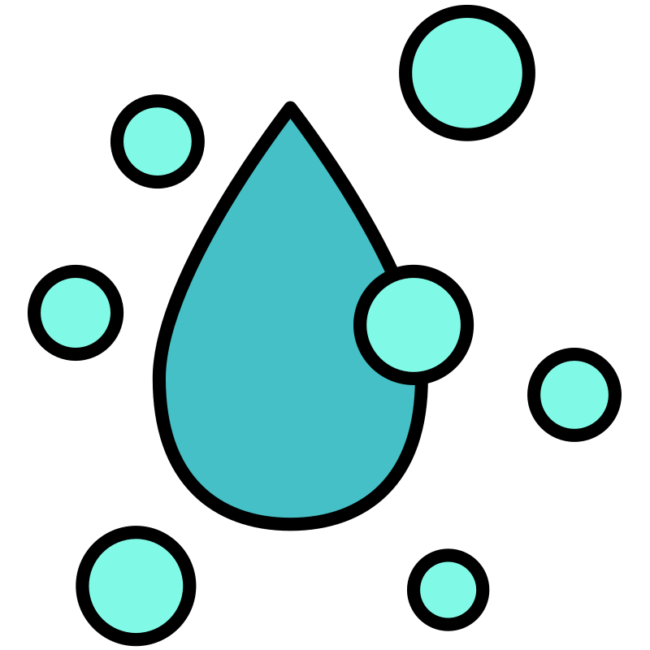
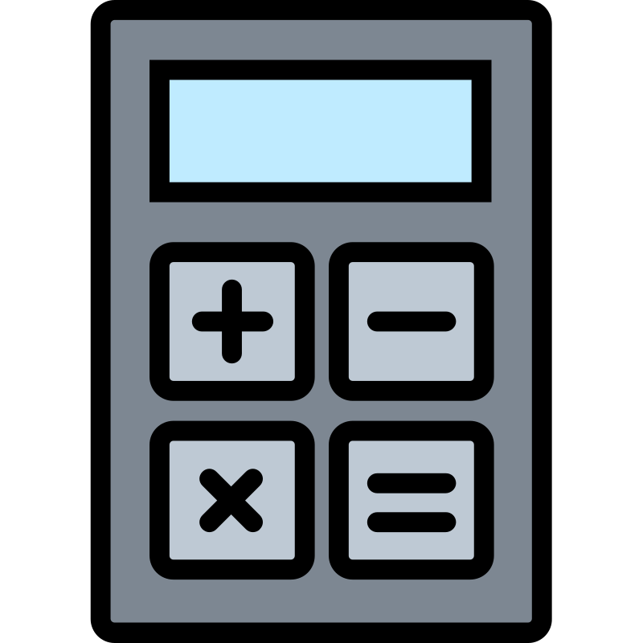

#  Programa de classificação — Conscientização ambiental
##  Autor do programa: Kaio Henrique da Silva
 Este programa foi criado em parceria com a companhia de saneamento do município para classificar e emitir alertas aos munícipes.

 Para executar o programa é simples, basta responder: 
1. tipo de imóvel (Comercial, Casa ou Apartamento);
2. quantidade de água em m³;
3. o sistema irá calcular automaticamente se o consumo está nos limites corretos!

 Esse programa foi desenvolvido pela linguagem de programação Python.